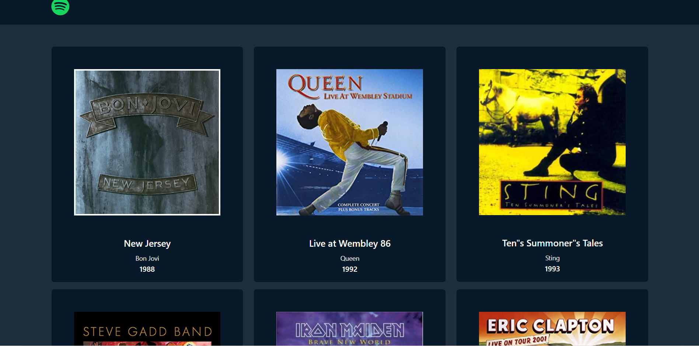
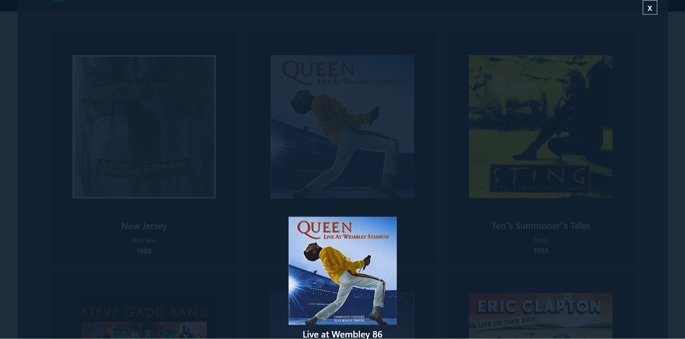

# PHP Dischi JSON

> WebApp che legge lista di dischi presente su un server

## DESCRIZIONE:

Creare una web-app che permetta di leggere una lista di dischi presente nel nostro server.

## TECNOLOGIE e LIBRERIE:

- Html
- CSS
- Bootstrap
- VueJS (importato tramite CDN)
- Axios
- PHP

## Bonus:

Al click su un disco, recuperare e mostrare i dati del disco selezionato in un overlay.

